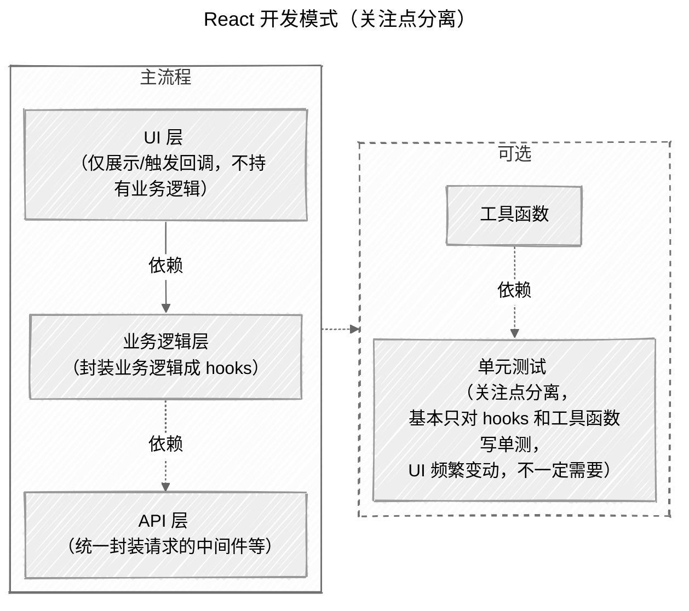

## 背景

当我们刚开始写 React 组件时，很容易把所有东西都塞在一个组件里：状态管理、副作用处理、API 请求、UI 渲染... 看起来简单直接，但随着项目复杂度增加，这种「一把梭」的写法会带来很多问题。

本文基于 `React` 展开，但方法同样适用于大多数前端框架。我们的目标是把「接口」「业务逻辑」「UI」从一团乱麻里拆开，让代码更可读、更可测、更易复用。

## 问题：混乱的组件代码

让我们先看看一个典型的搜索自动完成组件，它包含了我们刚才提到的所有问题：

```tsx
import React, { useEffect, useRef, useState } from 'react';

export function SearchAutocomplete() {
  // 定义状态
  const [query, setQuery] = useState('');
  const [options, setOptions] = useState<string[]>([]);
  const [loading, setLoading] = useState(false);
  const [err, setErr] = useState<string | null>(null);
  const abortRef = useRef<AbortController | null>(null);
  const timerRef = useRef<number | null>(null);

  // 定义逻辑
  useEffect(() => {
    if (!query) {
      setOptions([]);
      return;
    }
    if (timerRef.current) window.clearTimeout(timerRef.current);
    timerRef.current = window.setTimeout(async () => {
      if (abortRef.current) abortRef.current.abort();
      abortRef.current = new AbortController();
      setLoading(true);
      setErr(null);
      try {
        const resp = await fetch(`/api/search?q=${encodeURIComponent(query)}`, {
          signal: abortRef.current.signal,
        });
        if (!resp.ok) throw new Error('Network error');
        const data = (await resp.json()) as { items: string[] };
        setOptions(data.items);
      } catch (e: any) {
        if (e?.name !== 'AbortError') setErr(e.message || 'Unknown error');
      } finally {
        setLoading(false);
      }
    }, 300);
  }, [query]);

  // 定义 UI
  return (
    <div className="autocomplete">
      <input
        value={query}
        onChange={(e) => setQuery(e.target.value)}
        placeholder="输入搜索"
      />
      {loading && <div className="loading">加载中...</div>}
      {err && <div className="error">{err}</div>}
      {!loading && !err && options.length === 0 && query && (
        <div className="empty">无结果</div>
      )}
      <ul>
        {options.map((o) => (
          <li key={o}>{o}</li>
        ))}
      </ul>
    </div>
  );
}
```

这段代码看起来功能完整，但存在几个明显的问题：

- **误伤业务逻辑**：当你只想调整 UI 样式时，可能会不小心影响到防抖逻辑或请求处理
- **难以复用**：如果另一个页面也需要搜索功能，你只能复制粘贴这段代码
- **测试困难**：要测试这个组件，你既要渲染 UI 又要模拟网络请求，测试变得复杂且脆弱
- **阅读成本高**：错误处理、loading 状态、空状态和副作用逻辑混在一起，很难快速理解

## 解决方案：分层重构

既然问题出在「所有东西都混在一起」，那我们就按职责把它们分开：

### 第一层：接口服务层

首先，我们把 API 请求逻辑抽出来，让它只关心「如何发请求」：

```ts
// services/search-service.ts

// 中断请求标记，可作为中间件封装到统一的请求函数中
let inflightController: AbortController | null = null;

export async function search(query: string) {
  // 新请求到来时，取消上一个未完成的请求
  if (inflightController) {
    inflightController.abort();
  }
  inflightController = new AbortController();

  try {
    const resp = await fetch(`/api/search?q=${encodeURIComponent(query)}`, {
      signal: inflightController.signal,
    });
    if (!resp.ok) throw new Error('Network error');
    const data = (await resp.json()) as { items: string[] };
    return data.items;
  } catch (e: any) {
    // 透传 AbortError，交由上层决定是否忽略
    throw e;
  } finally {
    inflightController = null;
  }
}
```

这一层只负责：

- 发送 HTTP 请求
- 处理网络错误
- 管理请求取消（避免竞态条件）
- 返回标准化的数据格式

### 第二层：业务逻辑层（Hook）

接下来，我们把状态管理和副作用逻辑封装到 Hook 里：

```ts
// hooks/use-autocomplete.ts
import { useEffect, useRef, useState } from 'react';
import { search } from '../services/search-service';

export function useAutocomplete(debounceMs = 300) {
  const [query, setQuery] = useState('');
  const [options, setOptions] = useState<string[]>([]);
  const [loading, setLoading] = useState(false);
  const [err, setErr] = useState<string | null>(null);
  const timerRef = useRef<number | null>(null);

  useEffect(() => {
    if (!query) {
      setOptions([]);
      setErr(null);
      return;
    }
    if (timerRef.current) window.clearTimeout(timerRef.current);
    timerRef.current = window.setTimeout(async () => {
      setLoading(true);
      setErr(null);
      try {
        const items = await search(query); // 不再传 signal，也不管理 AbortController
        setOptions(items);
      } catch (e: any) {
        if (e?.name !== 'AbortError') setErr(e.message || 'Unknown error');
      } finally {
        setLoading(false);
      }
    }, debounceMs);
  }, [query, debounceMs]);

  return { query, setQuery, options, loading, err };
}
```

这一层负责：

- 管理搜索状态（query、options、loading、error）
- 实现防抖逻辑（避免频繁请求）
- 处理异步请求的生命周期
- 提供简洁的 API 给 UI 层使用

### 第三层：纯 UI 层

最后，UI 组件变得非常简洁，只关心「如何展示」：

```tsx
// components/autocomplete.tsx
import React from 'react';
import { useAutocomplete } from '../hooks/use-autocomplete';

export function Autocomplete() {
  const { query, setQuery, options, loading, err } = useAutocomplete(300);

  return (
    <div className="autocomplete">
      <input value={query} onChange={(e) => setQuery(e.target.value)} placeholder="输入搜索" />
      {loading && <div className="loading">加载中...</div>}
      {err && <div className="error">{err}</div>}
      {!loading && !err && options.length === 0 && query && <div className="empty">无结果</div>}
      <ul>
        {options.map((o) => (
          <li key={o}>{o}</li>
        ))}
      </ul>
    </div>
  );
}
```

这一层只负责：

- 渲染 UI 界面
- 响应用户交互
- 展示不同状态（loading、error、empty）
- 不包含任何业务逻辑

## 这样做的好处

通过分层重构，我们获得了以下收益：

- **可测试性**：可以单独测试 Hook 的业务逻辑，单独测试 UI 的渲染效果，测试变得简单且稳定
- **可复用性**：如果其他地方也需要搜索功能，直接引入 `useAutocomplete` Hook 即可；如果想换 API，只改服务层
- **可维护性**：UI 改动不会影响业务逻辑，业务逻辑改动不会影响 UI，各司其职
- **可替换性**：想把列表改成虚拟滚动？只改 UI 层；想换搜索策略？只改 Hook 层

## 结构示意


