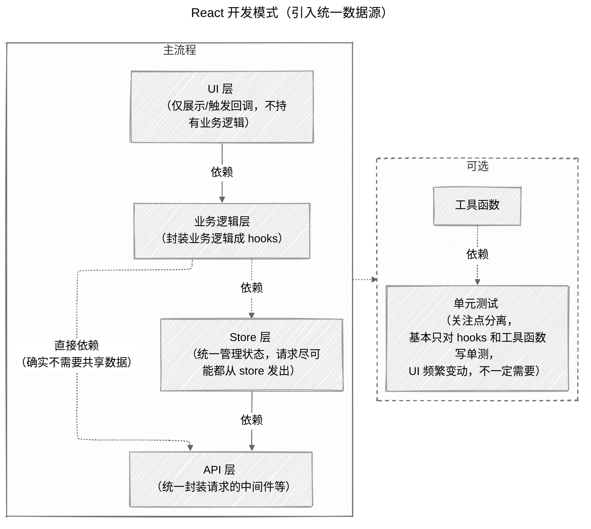

## 背景

在上一篇文章中，我们学会了如何在单个组件内做关注点分离。但随着项目复杂度增加，你会发现新的问题：**多个组件需要共享数据**。

比如一个电商网站，购物车数据需要在顶部导航栏、商品列表、购物车抽屉、结算栏等多个地方使用。如果每个组件都自己管理状态，就会出现数据不一致的问题。

## 问题：数据散落各处

在没有状态管理的情况下，我们只能通过 `props` 层层传递数据（暂不考虑 `useContext`，因为手写缓存与选择器有较大的心智负担）。

让我们看看一个购物车页面的例子：

```ts
// services/cart-service.ts
export type SkuId = string;
export type AddPayload = { skuId: SkuId; qty: number };
export type UpdateQtyPayload = { skuId: SkuId; qty: number };
export type RemovePayload = { skuId: SkuId };

export type CartItem = { skuId: SkuId; title: string; price: number; qty: number };
export type CartSnapshot = { items: CartItem[] };

export async function fetchCart(): Promise<CartSnapshot>;
export async function addCartItem(payload: AddPayload): Promise<void>;
export async function updateCartItemQty(payload: UpdateQtyPayload): Promise<void>;
export async function removeCartItem(payload: RemovePayload): Promise<void>;
```

```ts
// hooks/use-cart.ts
import {
  type CartItem,
  type SkuId,
  type AddPayload,
  type UpdateQtyPayload,
  type RemovePayload,
} from '../services/cart-service';

type PendingMap = Record<SkuId, boolean>;

export function useCart(): {
  items: CartItem[];
  loading: boolean;
  error: string | null;
  pendingBySku: PendingMap;
  subtotal: number;
  cartCount: number;
  canCheckout: boolean;
  add: (payload: AddPayload) => Promise<void> | void;
  updateQty: (payload: UpdateQtyPayload) => Promise<void> | void;
  remove: (payload: RemovePayload) => Promise<void> | void;
};
```

```tsx
// pages/shop-page.tsx
import { useCart } from '../hooks/use-cart';

export function ShopPage() {
  const {
    items,
    loading,
    error,
    pendingBySku,
    subtotal,
    cartCount,
    canCheckout,
    add,
    updateQty,
    remove,
  } = useCart();

  return (
    <>
      <TopBar cartCount={cartCount} />
      <ProductList
        products={[] /* fetched products */}
        cartItems={Object.fromEntries(items.map((i) => [i.skuId, i]))}
        addToCart={add}
        pendingBySku={pendingBySku}
      />
      <CartDrawer items={items} onUpdateQty={updateQty} onRemove={remove} subtotal={subtotal} />
      <CheckoutBar totalPrice={subtotal} canCheckout={canCheckout} />
      {loading && <div>Loading...</div>}
      {error && <div className="error">{error}</div>}
    </>
  );
}
```

这种写法虽然能工作，但存在明显的问题：

- **Props 传递地狱**：购物车数据要一层层往下传，中间组件被迫接收它们不需要的 props
- **顶层组件臃肿**：页面组件被迫管理所有子组件需要的状态，职责不清
- **难以维护**：新增一个需要购物车数据的组件，就要修改整个传递链

## 解决方案：引入统一数据源

我们需要一个「统一的数据源（Store）」来集中管理状态与动作，让组件按需订阅。这里以 `zustand` 为例，它是一个轻量级的状态管理库。

### 第一步：创建 Store

首先，我们把购物车的状态和动作都集中到一个 Store 里：

```ts
// stores/cart-store.ts
import { type CartItem, type SkuId, type AddPayload, type UpdateQtyPayload, type RemovePayload } from '../services/cart-service';

export type CartStore = {
  // 状态
  items: CartItem[];
  pendingBySku: Record<SkuId, boolean>;
  // 派生
  subtotal: number;
  cartCount: number;
  canCheckout: boolean;
  // 动作
  initBySkuId: (id: SkuId) => Promise<void> | void;
  fetchCart: () => Promise<void> | void;
  add: (payload: AddPayload) => Promise<void> | void;
  updateQty: (payload: UpdateQtyPayload) => Promise<void> | void;
  remove: (payload: RemovePayload) => Promise<void> | void;
};

// 仅保留 Hook 签名，供组件选择订阅
export const useCartStore: {
  <T>(selector: (s: CartStore) => T, equalityFn?: (a: T, b: T) => boolean): T;
  (): CartStore;
};
```

Store 集中管理了：

- **状态**：购物车商品、加载状态等
- **派生状态**：总价、商品数量、是否可结算等计算属性
- **动作**：添加、删除、更新商品等操作

### 第二步：创建友好的 Hook 接口

虽然 Store 提供了完整的功能，但直接使用可能不够友好。我们创建一些 Hook 来提供更简洁的 API：

```ts
// hooks/use-cart-facade.ts
import { type CartItem, type SkuId, type AddPayload, type UpdateQtyPayload, type RemovePayload } from '../services/cart-service';
import { useCartStore } from '../stores/cart-store.ts';

// 获取购物车状态的 Hook
export function useCartState(): {
  items: CartItem[];
  pendingBySku: Record<SkuId, boolean>;
  subtotal: number;
  cartCount: number;
  canCheckout: boolean;
} => {
  // store 状态（示意，这里应该只需要引入 hooks 确实需要的状态）
  const items = useCartStore(state => state.items);
  const pendingBySku = useCartStore(state => state.pendingBySku)；
  const subtotal = useCartStore(state => state.subtotal)；
  const cartCount = useCartStore(state => state.cartCount)；
  const canCheckout = useCartStore(state => state.canCheckout)；

  // 也可在 Hook 内组合局部 UI 状态（示意）
  // const loading = useRef(...)

  return {
    items,
    pendingBySku,
    subtotal,
    cartCount,
    canCheckout,
  };
};

// 获取购物车操作的 Hook
export function useCartActions(): {
  fetchCart: () => Promise<void> | void;
  add: (payload: AddPayload) => Promise<void> | void;
  updateQty: (payload: UpdateQtyPayload) => Promise<void> | void;
  remove: (payload: RemovePayload) => Promise<void> | void;
  addOrUpdateFlow: (payload: AddPayload | UpdateQtyPayload) => Promise<void> | void;
} => {
  const add = useCartStore(state => state.add);
  const updateQty = useCartStore(state => state.updateQty);

  // 组合 store api 形成新的 api（仅示意）
  const addOrUpdateFlow = (payload: AddPayload | UpdateQtyPayload) => {
    if ((payload as any).id) {
      return updateQty(payload as UpdateQtyPayload);
    }
    return add(payload as AddPayload);
  };

  return {
    add,
    updateQty,
    addOrUpdateFlow,
    // fetchCart: useCartStore(state => state.fetchCart),
    // remove: useCartStore(state => state.remove),
  };
};

// 获取单个商品信息的 Hook（细粒度订阅）
export function useCartItem(skuId: SkuId): {
  qty: number;
  isPending: boolean;
} => {
  // 订阅细粒度切片（示意）
  const qty = useCartStore(state => state.items.find(i => i.skuId === skuId)?.qty ?? 0);
  const isPending = useCartStore(state => !!state.pendingBySku[skuId]);

  return {
    qty,
    isPending,
  };
};
```

这些 Hook 提供了：

- **状态 Hook**：只订阅需要的状态，避免不必要的重渲染
- **操作 Hook**：提供简洁的操作接口，可以组合多个 Store 方法
- **细粒度 Hook**：针对特定商品的状态订阅，性能更优

### 第三步：简化组件代码

```tsx
// pages/shop-page.tsx
import { TopBar } from '../components/top-bar';
import { ProductList } from '../components/product-list';
import { CartDrawer } from '../components/cart-drawer';
import { CheckoutBar } from '../components/checkout-bar';

export function ShopPage(): JSX.Element {
  return (
    <>
      <TopBar />
      <ProductList />
      <CartDrawer />
      <CheckoutBar />
    </>
  );
}
```

```tsx
// components/product-list.tsx
import { useCartActions, useCartState } from '../hooks/use-cart-facade';

export function ProductList(): JSX.Element {
  const { add } = useCartActions();
  const { pendingBySku, items } = useCartState();
  return null;
}
```

看，现在每个组件都可以直接使用需要的状态和操作，不再需要层层传递 props！

## 额外收益：统一初始化入口

状态都集中到 `store` 后，还有一个额外的好处：可以在应用入口统一初始化数据，避免各个组件「各拉各的」：

```ts
// ./entry.ts
export function initStore() {
  const uri = new URL(location.href);

  const cartId = uri.searchParams.get('cart_id');
  if (cartId) {
    // 用异步加载，避免入口文件过大
    import('./stores/cart-store.ts').then(({ useCartStore }) => {
      useCartStore.getState().initBySkuId(cartId as any);
    });
  }

  // 其他 store 的初始化逻辑
}
```

这样做的好处：

- **统一管理**：所有数据初始化都在一个地方，便于调试和维护
- **性能优化**：避免多个组件重复请求相同数据
- **代码简洁**：组件只需要关心展示，不需要关心数据初始化

## 最终结构示意



## FYI

- [zustand 比较](https://zustand.docs.pmnd.rs/getting-started/comparison#redux)
