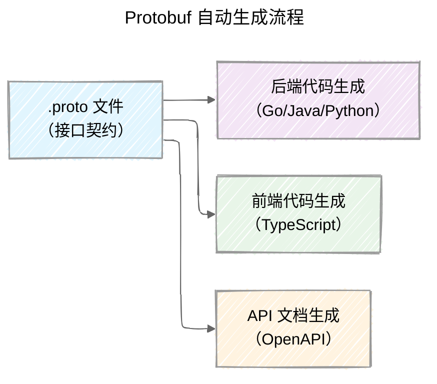
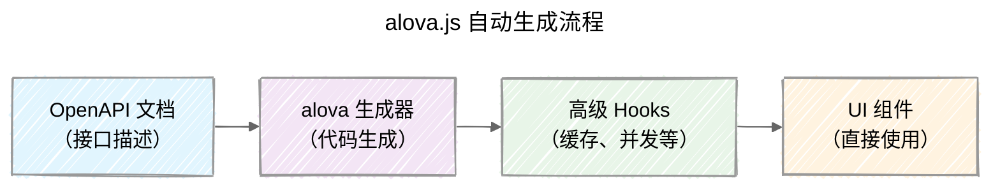
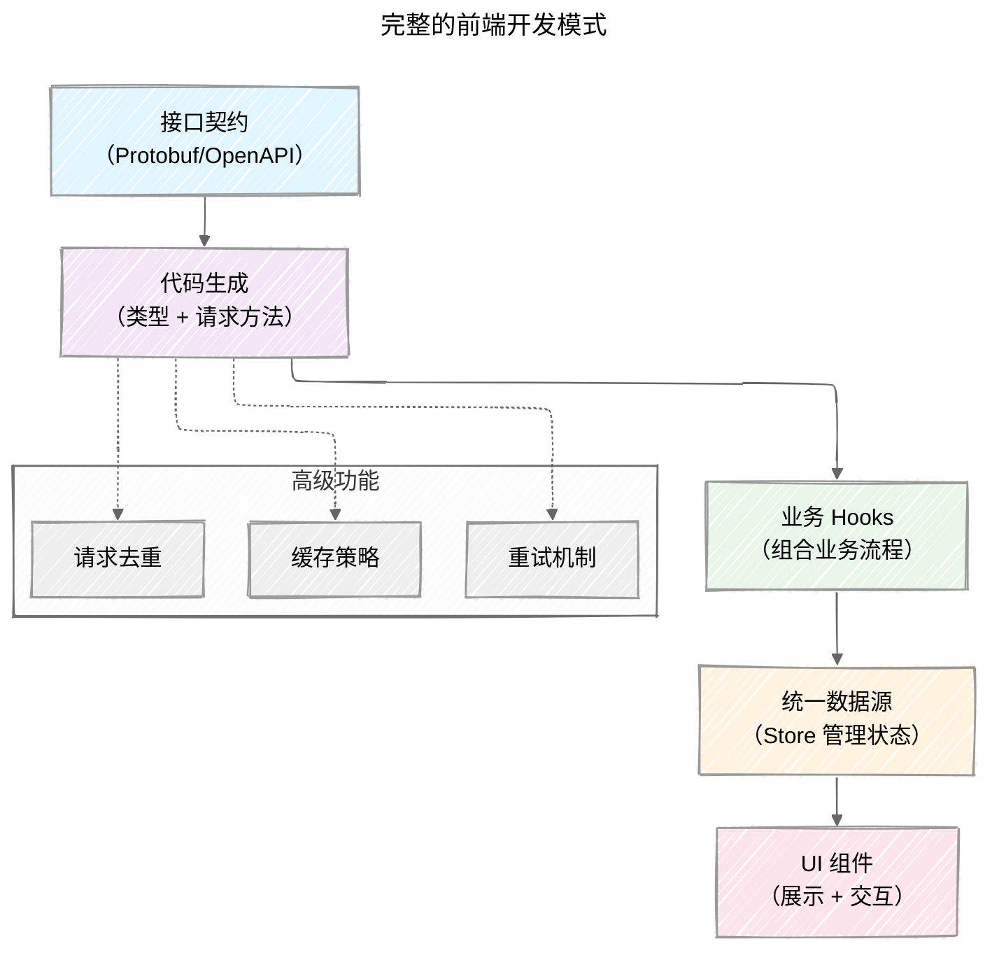

## 背景

在前面的两篇文章中，我们探讨了如何通过「关注点分离」将业务逻辑从 UI 中抽离，以及如何通过「引入统一数据源」来管理跨组件的共享状态。这些模式让我们的代码结构更加清晰，依赖关系更加明确。

然而，还有一个环节仍然充斥着大量重复劳动：**API 层的编写**。

想象一下，每次对接新接口时，你都需要：

- 手动定义请求和响应的 TypeScript 类型
- 拼接 URL 路径和查询参数
- 处理各种边界情况（空数组、枚举值、时间格式等）
- 编写错误处理逻辑
- 与请求库（axios、fetch）对接

这些工作不仅重复，还容易出错。更糟糕的是，当后端接口发生变化时，前端往往要等到运行时才发现类型不匹配。

本文将介绍如何通过**自动生成接口文件**来解决这些问题，让接口契约成为唯一的真相来源。

## 手写 service 的典型痛点

让我们先看看手写 API 层会遇到哪些问题：

### 1. 重复劳动，容易遗漏

每次新增接口，你都需要在多个地方维护相同的信息：

- 后端：定义数据结构和服务方法
- 文档：更新 API 文档
- 前端：编写 TypeScript 类型和请求函数

这种重复不仅浪费时间，还容易在某个环节遗漏更新。

### 2. 契约不一致，运行时才发现

最让人头疼的是，当后端修改了接口结构，前端往往要等到运行时才发现类型不匹配。比如：

```ts
// 后端返回了新的字段，但前端类型定义还是旧的
interface UserResponse {
  id: string;
  name: string;
  // 后端新增了 email 字段，但前端类型没更新
}

// 运行时才发现 user.email 是有值
const user = await fetchUser();
console.log(user.email); // 有值，但 TypeScript 会报错
```

### 3. 边界行为不统一

不同接口对于空值的处理可能不一致：

- 空数组应该返回 `[]` 还是 `null`？
- 枚举值应该用数字还是字符串？
- 时间字段用什么格式？

手写很难保证这些约定的一致性。

### 4. 高级功能重复实现

每个 service 都需要自己实现：

- 请求去重
- 缓存策略
- 错误重试
- 并发控制

这些逻辑分散在各个文件中，难以统一管理和测试。

## 解决方案一：基于 Protobuf 的自动生成

既然手写有这么多问题，我们来看看如何通过自动生成来解决。

### 为什么选择 Protobuf？

Protobuf 是一个跨语言的数据序列化协议，它的核心思想是：**一份契约，多端共享**。

```protobuf
// user.proto
syntax = "proto3";

message User {
  string id = 1;
  string name = 2;
  string email = 3;
  repeated string tags = 4;  // 空数组会强制输出为 []
}

service UserService {
  rpc GetUser(GetUserRequest) returns (User);
  rpc CreateUser(CreateUserRequest) returns (User);
}
```

这份 `.proto` 文件可以同时用于：

- 后端：生成 Go/Java/Python 等语言的代码
- 前端：生成 TypeScript 类型和请求方法
- 文档：自动生成 API 文档

### 工作流程



### 具体实现步骤

1. **安装生成器**

```bash
go get github.com/moecasts/protoc-gen-typescript-http
```

2. **生成 TypeScript 代码**

```bash
protoc \
  --typescript-http_out ./generated \
  --typescript-http_opt use_enum_numbers=true,use_multi_line_comment=true \
  ./proto/**/*.proto
```

3. **使用生成的代码**

```ts
import axios from 'axios';
import { createUserServiceClient } from './generated/user/v1';

// 创建客户端，可以自定义请求实现
export const userService = createUserServiceClient((request) => {
  const API_BASE = 'https://api.example.com';
  return axios({ 
    url: `${API_BASE}/${request.path}`, 
    method: request.method, 
    data: request.body 
  }).then(r => r.data);
});

// 类型安全的调用
const user = await userService.getUser({ id: '123' });
console.log(user.name); // TypeScript 会提供完整的类型提示
```

### 与 React 生态结合：使用 useSWR

生成的代码提供了 `uris` 工具，可以轻松与 `useSWR` 结合：

```ts
import useSWR from 'swr';
import { userService } from './services/user';

function UserProfile({ userId }: { userId: string }) {
  const { data: user, error, isLoading } = useSWR(
    userService.uris.getUserURI({ id: userId }),
    () => userService.getUser({ id: userId })
  );

  if (isLoading) return <div>加载中...</div>;
  if (error) return <div>加载失败</div>;
  
  return <div>用户名：{user.name}</div>;
}
```

**这样做的好处：**

- ✅ 类型安全：所有接口都有完整的 TypeScript 类型
- ✅ 自动缓存：SWR 提供去重、缓存、重新验证等功能
- ✅ 灵活控制：可以自定义请求拦截器、错误处理等
- ✅ 契约一致：前后端共享同一份 `.proto` 文件

## 解决方案二：基于 OpenAPI 的 alova.js

如果你的团队已经使用 OpenAPI 来管理接口文档，那么 `alova.js` 可能是更好的选择。

### 为什么选择 alova.js？

`alova.js` 不仅仅是一个代码生成工具，它提供了一套完整的请求状态管理方案：

- **从 OpenAPI 自动生成**：根据 OpenAPI 规范生成强类型的请求函数
- **内置高级功能**：缓存、去重、重试、并发控制等开箱即用
- **多端适配**：支持浏览器、Node.js、小程序等多个环境
- **统一配置**：所有接口共享同一套策略，避免重复配置

### 工作流程



### 具体实现

1. **生成代码**

```bash
npx @alova/cli openapi \
  --input ./openapi.yaml \
  --output ./src/api \
  --client axios
```

2. **使用生成的 Hooks**

```ts
import { useRequest } from 'alova';
import { createClient } from '@/api/client';

const api = createClient();

export function useUser(userId: string) {
  const { data, loading, error, send } = useRequest(
    api.users.getUser({ id: userId }),
    { 
      immediate: true,        // 立即执行
      cacheFor: 30000,        // 缓存 30 秒
      staleFor: 5000,         // 5 秒后标记为过期
      retry: 3,               // 失败重试 3 次
      retryDelay: 1000        // 重试间隔 1 秒
    }
  );

  return { 
    user: data, 
    loading, 
    error, 
    refresh: send 
  };
}
```

3. **在组件中使用**

```tsx
function UserProfile({ userId }: { userId: string }) {
  const { user, loading, error, refresh } = useUser(userId);

  if (loading) return <div>加载中...</div>;
  if (error) return <div>加载失败</div>;
  
  return (
    <div>
      <h1>{user.name}</h1>
      <button onClick={refresh}>刷新</button>
    </div>
  );
}
```

### 两种方案对比

| 特性 | Protobuf + useSWR | OpenAPI + alova.js |
|------|------------------|-------------------|
| **契约格式** | `.proto` 文件 | OpenAPI 文档 |
| **类型生成** | ✅ 完整类型 | ✅ 完整类型 |
| **缓存策略** | 需要手动配置 SWR | ✅ 内置多种策略 |
| **并发控制** | 需要手动实现 | ✅ 内置去重、节流 |
| **错误处理** | 需要手动配置 | ✅ 内置重试机制 |
| **学习成本** | 较低（熟悉 SWR 即可） | 中等（需要学习 alova 生态） |
| **定制能力** | 高（完全控制请求实现） | 中等（需要按 alova 规范扩展） |

## 如何选择？

选择哪种方案主要看你的团队现状和需求：

### 选择 Protobuf + useSWR 的场景

- ✅ 团队已有 gRPC/Protobuf 生态
- ✅ 需要完全控制请求实现（自定义拦截器、错误处理等）
- ✅ 团队熟悉 SWR，学习成本低
- ✅ 追求轻量级，不想引入过多依赖

### 选择 OpenAPI + alova.js 的场景

- ✅ 团队已有 OpenAPI 文档管理流程
- ✅ 希望开箱即用的高级功能（缓存、重试、并发控制等）
- ✅ 需要多端支持（小程序、Node.js 等）
- ✅ 追求统一配置，减少重复代码

## 完整的开发模式

现在，我们已经有了完整的前端开发模式：



### 各层职责清晰

1. **接口契约层**：Protobuf 或 OpenAPI 作为唯一真相来源
2. **代码生成层**：自动生成类型和请求方法，减少手写错误
3. **业务逻辑层**：Hooks 组合业务流程，与 UI 解耦
4. **状态管理层**：Store 统一管理跨组件状态
5. **UI 展示层**：纯展示组件，只负责渲染和触发回调

这样的分层让每一层都有明确的职责，既保证了代码的可维护性，又提供了足够的灵活性。

## FYI

- [《前端开发模式探索 - 关注点分离》](./frontend-development-pattern-exploration-1-separation-of-concerns)
- [《前端开发模式探索 - 引入统一数据源》](./frontend-development-pattern-exploration-2-introducing-a-unified-data-source)
- [《基于 Protobuf 统一和加速前后端协作》](./unifying-and-accelerating-frontend-backend-collaboration-with-protobuf)
- [alova.js 文档](https://alova.js.org/)
