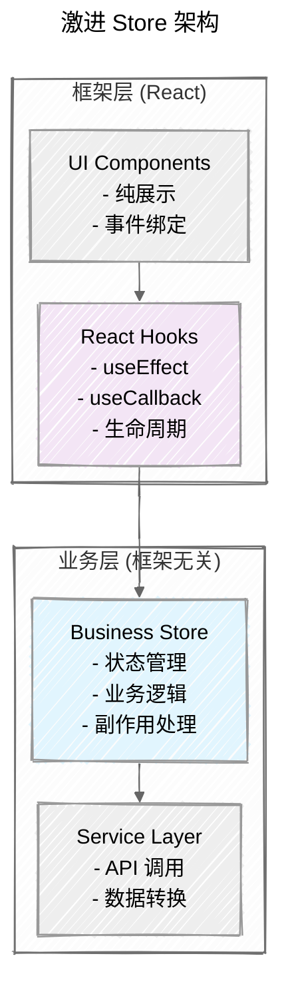
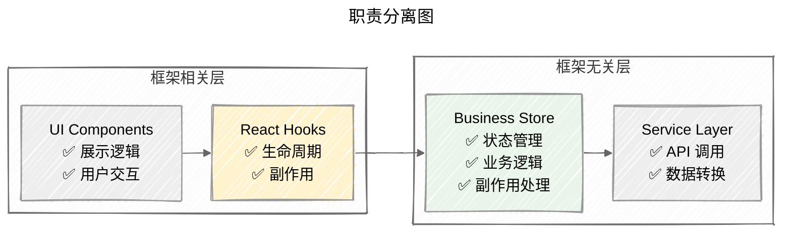
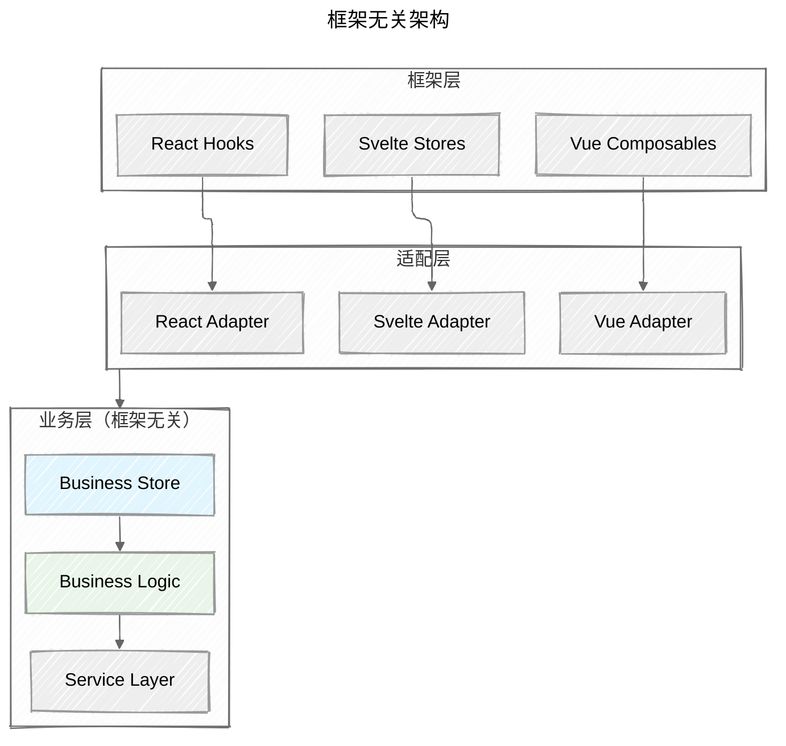

## 背景

> **⚠️ 实验性文章**：本文探讨的是一种激进的前端架构模式，请根据你的项目情况谨慎评估。

在之前的文章中，我们学会了如何引入统一数据源来解决组件间数据共享的问题。但随着项目规模增长，我发现了一个新的问题：**Store 和 Hook 的职责边界变得模糊**。

当业务逻辑既需要 React 特性（如生命周期、副作用），又需要跨组件共享时，我们往往会在 Store 和 Hook 之间反复横跳，导致代码结构混乱。

本文将探索一种激进的前端架构模式：**让 Store 承担更多业务逻辑职责，实现框架无关的状态管理**。

## 问题：Store 和 Hook 的职责混乱

让我们通过一个典型的用户管理模块来理解当前架构的问题：

```ts
// stores/user-store.ts
export const useUserStore = create<UserStore>((set, get) => ({
  users: [],
  currentUser: null,
  loading: false,
  error: null,
  
  setUsers: (users) => set({ users }),
  setCurrentUser: (user) => set({ currentUser: user }),
  setLoading: (loading) => set({ loading }),
  setError: (error) => set({ error }),
}));

// hooks/use-user.ts
export function useUser() {
  const users = useUserStore(state => state.users);
  const currentUser = useUserStore(state => state.currentUser);
  const loading = useUserStore(state => state.loading);
  const error = useUserStore(state => state.error);
  const setUsers = useUserStore(state => state.setUsers);
  const setCurrentUser = useUserStore(state => state.setCurrentUser);
  const setLoading = useUserStore(state => state.setLoading);
  const setError = useUserStore(state => state.setError);
  
  // 业务逻辑：获取用户列表
  const fetchUsers = useCallback(async () => {
    setLoading(true);
    try {
      const users = await userService.getUsers();
      setUsers(users);
    } catch (err) {
      setError(err.message);
    } finally {
      setLoading(false);
    }
  }, [setUsers, setLoading, setError]);
  
  // 业务逻辑：登录
  const login = useCallback(async (credentials) => {
    // 非重点逻辑
  }, [setCurrentUser, setLoading, setError]);
  
  // React 特性：自动获取用户信息
  useEffect(() => {
    if (!currentUser) {
      fetchUsers();
    }
  }, [currentUser, fetchUsers]);
  
  return {
    users,
    currentUser,
    loading,
    error,
    fetchUsers,
    login,
  };
}
```

这种模式存在明显问题：

- **职责不清**：Store 只管理状态，Hook 管理业务逻辑，但两者紧密耦合
- **重复代码**：每个 Hook 都要重新实现相同的错误处理、加载状态管理
- **难以测试**：业务逻辑和 React 特性混在一起，单元测试变得复杂
- **框架绑定**：业务逻辑被 React Hook 规则束缚，难以复用

这些问题促使我们思考：**能否让 Store 承担更多职责，实现更清晰的架构分离？**

## 激进方案：让 Store 承担更多职责

### 核心思想

**让 Store 成为业务逻辑的唯一载体，Hook 只负责框架特定的功能。**

这种架构的核心优势在于：

- **业务逻辑集中**：所有业务逻辑都在 Store 中，便于维护和测试
- **框架解耦**：业务逻辑与 React 特性分离，可以轻松适配其他框架
- **职责清晰**：Store 专注业务，Hook 专注框架特性



### 1. 统一的 Store 设计

在新的架构中，Store 不仅管理状态，还承担业务逻辑：

```ts
// stores/user-store.ts
import { create } from 'zustand';
import { userService } from '../services/user-service';
import { userBusiness } from '../business/user-business';

export interface UserStore {
  // 状态
  users: User[];
  currentUser: User | null;
  loading: boolean;
  error: string | null;
  
  // 业务动作
  fetchUsers: () => Promise<void>;
  login: (credentials: LoginCredentials) => Promise<void>;
  logout: () => void;
  updateUser: (id: string, updates: Partial<User>) => Promise<void>;
  
  // 派生状态
  isAuthenticated: boolean;
  userCount: number;
}

export const useUserStore = create<UserStore>((set, get) => ({
  // 初始状态
  users: [],
  currentUser: null,
  loading: false,
  error: null,
  
  // 业务逻辑：获取用户列表
  fetchUsers: async () => {
    set({ loading: true, error: null });
    try {
      const users = await userBusiness.fetchUsers(userService);
      set({ users, loading: false });
    } catch (error) {
      set({ error: error.message, loading: false });
    }
  },
  
  // 业务逻辑：用户登录
  login: async (credentials) => {
    // 非重点逻辑
  },
  
  // 业务逻辑：登出
  logout: () => {
    userBusiness.logout();
    set({ currentUser: null, users: [] });
  },
  
  // 业务逻辑：更新用户
  updateUser: async (id, updates) => {
    // 非重点逻辑
  },
  
  // 派生状态
  get isAuthenticated() {
    return !!get().currentUser;
  },
  
  get userCount() {
    return get().users.length;
  },
}));
```

### 2. 业务逻辑层：纯函数实现

为了保持业务逻辑的纯净性，我们将业务逻辑抽取为纯函数：

```ts
// business/user-business.ts
export const userBusiness = {
  // 业务逻辑：获取用户列表
  async fetchUsers(userService: UserService) {
    const users = await userService.getUsers();
    return users.filter(user => user.isActive);
  },
  
  // 业务逻辑：用户登录
  async login(credentials: LoginCredentials, userService: UserService) {
    // 非重点逻辑
  },
  
  // 业务逻辑：登出
  logout() {
    localStorage.removeItem('user_token');
  },
  
  // 业务逻辑：更新用户
  async updateUser(id: string, updates: Partial<User>, userService: UserService) {
    // 非重点逻辑
  },
};
```

### 3. 框架适配层：React Hook

Hook 只负责框架特定的功能，如生命周期和副作用：

```ts
// hooks/use-user-adapter.ts
import { useEffect } from 'react';
import { useUserStore } from '../stores/user-store';

export function useUserAdapter() {
  const currentUser = useUserStore(state => state.currentUser);
  const loading = useUserStore(state => state.loading);
  const error = useUserStore(state => state.error);
  const fetchUsers = useUserStore(state => state.fetchUsers);
  
  // 框架特定的逻辑：自动初始化
  useEffect(() => {
    if (!currentUser && !loading) {
      fetchUsers();
    }
  }, [currentUser, loading, fetchUsers]);
  
  // 框架特定的逻辑：错误处理
  useEffect(() => {
    if (error) {
      console.error('User store error:', error);
    }
  }, [error]);
  
  return { currentUser, loading, error, fetchUsers };
}

export function useUserList() {
  return useUserStore(state => ({
    users: state.users,
    loading: state.loading,
    error: state.error,
  }));
}

export function useUserAuth() {
  return useUserStore(state => ({
    currentUser: state.currentUser,
    isAuthenticated: state.isAuthenticated,
    login: state.login,
    logout: state.logout,
  }));
}
```

## 防止 Store 膨胀：按功能拆分

虽然我们让 Store 承担更多职责，但要注意防止单个 Store 变得过于庞大。这是新架构面临的一个重要挑战：

```ts
// ❌ 错误做法：一个巨大的 Store
export const useAppStore = create<AppStore>((set, get) => ({
  // 用户相关
  users: [],
  currentUser: null,
  userLoading: false,
  userError: null,
  fetchUsers: async () => { /* ... */ },
  login: async () => { /* ... */ },
  
  // 购物车相关
  cartItems: [],
  cartLoading: false,
  cartError: null,
  addToCart: async () => { /* ... */ },
  removeFromCart: async () => { /* ... */ },
  
  // 商品相关
  products: [],
  productLoading: false,
  productError: null,
  fetchProducts: async () => { /* ... */ },
  updateProduct: async () => { /* ... */ },
}));

// ✅ 正确做法：按功能域拆分
export const useUserStore = create<UserStore>((set, get) => ({
  users: [],
  currentUser: null,
  loading: false,
  error: null,
  fetchUsers: async () => { /* ... */ },
  login: async () => { /* ... */ },
}));

export const useCartStore = create<CartStore>((set, get) => ({
  items: [],
  loading: false,
  error: null,
  addItem: async () => { /* ... */ },
  removeItem: async () => { /* ... */ },
}));
```

### Store 拆分原则

为了避免 Store 膨胀，我们需要遵循以下拆分原则：

1. **按业务域拆分**：用户、购物车、商品、订单等
2. **按数据生命周期拆分**：临时数据、持久化数据
3. **按使用频率拆分**：高频访问、低频访问
4. **按团队职责拆分**：不同团队负责不同 Store

通过合理的拆分，我们可以保持架构的清晰性和可维护性。

## 架构优势

这种激进的使用 Store 的模式带来了显著的架构优势：

### 1. 清晰的职责分离



### 2. 业务逻辑集中

- **业务逻辑**：集中在 Store 中，便于维护和调试
- **状态管理**：统一的 Store 模式，减少学习成本
- **测试友好**：业务逻辑与框架解耦，单元测试更简单

### 3. 更好的代码组织

- **单一职责**：每个 Store 专注于特定的业务域
- **易于理解**：业务逻辑集中，代码结构更清晰
- **便于协作**：团队成员可以专注于特定的 Store 模块

## 潜在问题与限制

虽然这种架构模式有很多优势，但我们也需要认识到它的局限性：

### 1. 学习曲线

- 开发者需要理解 Store 和 Hook 的新职责划分
- 需要建立新的代码组织规范
- 团队需要时间来适应新的开发模式

### 2. 复杂度考虑

- Store 承担更多职责可能增加复杂度
- 需要合理设计选择器，保持代码清晰
- **Store 膨胀风险**：单个 Store 可能变得过于庞大，需要按功能域拆分

### 3. 调试复杂性

- 业务逻辑集中在 Store 中，调试可能更复杂
- 需要更好的开发工具支持
- 错误追踪可能变得更加困难

### 4. 框架特性限制

- 某些 React 特性（如 Suspense、Error Boundary）可能难以在 Store 中实现
- 需要权衡业务逻辑的复用性和框架特性的使用
- 可能无法充分利用某些框架的高级特性

## 框架无关性探索

当业务逻辑都抽到 Store 后，我们可以实现框架无关的状态管理。这是这种架构模式的一个重要优势：**通过抽象中间层，同一套业务逻辑可以在不同框架间复用**。

### 为什么需要框架无关性？

- **技术栈灵活性**：团队可以选择最适合的前端框架
- **业务逻辑复用**：同一套业务逻辑可以支持多个前端项目
- **降低技术债务**：业务逻辑与框架解耦，减少技术风险
- **团队协作**：不同团队可以使用不同的技术栈，但共享业务逻辑

### 1. 架构设计

框架无关的架构需要分层设计：



### 2. 统一状态管理接口

为了实现框架无关性，我们需要定义统一的状态管理接口：

```ts
// core/store-interface.ts
export interface StoreInterface<T> {
  getState(): T;
  setState(partial: Partial<T>): void;
  subscribe(listener: (state: T) => void): () => void;
}

export interface UserStoreInterface {
  users: User[];
  currentUser: User | null;
  loading: boolean;
  error: string | null;
  
  fetchUsers(): Promise<void>;
  login(credentials: LoginCredentials): Promise<void>;
  logout(): void;
}
```

### 3. Vue 适配方案

让我们看看如何为 Vue 实现适配层：

```ts
// adapters/vue/user-store.ts
import { ref, computed } from 'vue';
import { userBusiness } from '../../business/user-business';
import { userService } from '../../services/user-service';

export function useUserStore() {
  const state = ref({
    users: [],
    currentUser: null,
    loading: false,
    error: null,
  });
  
  const fetchUsers = async () => {
    state.value.loading = true;
    state.value.error = null;
    try {
      const users = await userBusiness.fetchUsers(userService);
      state.value.users = users;
    } catch (error) {
      state.value.error = error.message;
    } finally {
      state.value.loading = false;
    }
  };
  
  const login = async (credentials) => {
    // 非重点逻辑
  };
  
  const logout = () => {
    userBusiness.logout();
    state.value.currentUser = null;
    state.value.users = [];
  };
  
  const isAuthenticated = computed(() => !!state.value.currentUser);
  
  return {
    // 状态
    users: computed(() => state.value.users),
    currentUser: computed(() => state.value.currentUser),
    loading: computed(() => state.value.loading),
    error: computed(() => state.value.error),
    isAuthenticated,
    
    // 方法
    fetchUsers,
    login,
    logout,
  };
}
```

### 4. 迁移策略

从 React 迁移到 Vue 只需要三个步骤：

1. **保持业务逻辑不变**：`userBusiness` 和 `userService` 完全复用
2. **替换状态管理**：从 Zustand 切换到 Vue 的响应式系统
3. **更新组件**：将 React Hook 改为 Vue Composable

这种迁移策略的优势在于：

- **风险可控**：业务逻辑保持不变，只需要替换框架层
- **渐进式**：可以逐步迁移，不需要一次性重写
- **团队协作**：不同团队可以负责不同模块的迁移

```ts
// React 版本
export function useUser() {
  const users = useUserStore(state => state.users);
  const fetchUsers = useUserStore(state => state.fetchUsers);
  // 非重点逻辑
}

// Vue 版本
export function useUser() {
  const { users, fetchUsers } = useUserStore();
  // 非重点逻辑
}
```

### 5. 实际应用场景

这种框架无关的架构特别适合以下场景：

- **多框架项目**：同一套业务逻辑支持 React、Vue、Svelte
- **团队技术栈统一**：不同团队可以保持技术栈独立性
- **渐进式迁移**：可以逐步从 React 迁移到 Vue，业务逻辑无需重写
- **长期维护**：业务逻辑与框架解耦，降低技术债务
- **微前端架构**：不同子应用可以使用不同的框架，但共享业务逻辑

## 总结

这种激进的使用 Store 的模式，通过让 Store 承担更多业务逻辑职责，实现了：

- **更好的关注点分离**：Store 专注业务，Hook 专注框架
- **业务逻辑集中**：业务逻辑集中在 Store 中，便于维护
- **更清晰的架构**：分层设计让代码结构更清晰
- **更好的测试性**：业务逻辑与框架解耦，测试更简单
- **框架无关性**：同一套业务逻辑可以在不同框架间复用

### 适用场景

这种架构模式特别适合：

- **大型项目**：需要集中管理复杂业务逻辑
- **多团队协作**：不同团队负责不同模块
- **长期维护**：需要降低技术债务的项目
- **多框架支持**：需要支持多个前端框架的项目

### 注意事项

但这是一种实验性的架构模式，需要根据具体项目情况谨慎评估。对于小型项目或简单的状态管理需求，这种模式可能过于复杂。

你觉得这种激进的使用 Store 的方式如何？是否值得在你的项目中尝试？

## FYI

- [Zustand 官方文档](https://zustand.docs.pmnd.rs/)
- [Zustand Slices Pattern](https://zustand.docs.pmnd.rs/guides/slices-pattern)
- [前端开发模式探索 - 引入统一数据源](./frontend-development-pattern-exploration-2-introducing-a-unified-data-source)
