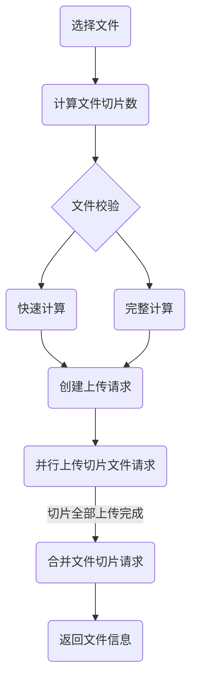

## 流程

<div style="display: flex; justify-content: center;">



</div>

## Restful Api

---

### **POST**  创建上传请求

#### Request

##### Header

```yaml
Authorization: Bearer Token
```

##### Body

```js
{
  size: Int, // 文件大小
  chunks: Int, // 切片索引总数
  hash: String // 完整文件的 hash
}
```

---

### **PATCH** 切片上传请求

#### Request

###### Header

```yaml
Authorization: Bearer Token
```

##### Body

```js
{
  file: Blob, // 切片 Blob
  chunk: Int, // 当前切片索引
  hash: String // 完整文件的 hash
}
```

---

### **PUT** 合并切片请求

#### Request

###### Header

```yaml
Authorization: Bearer Token
```

##### Body

```js
{
  chunks: Int, // 切片索引总数
  hash: String // 完整文件的 hash
}
```

#### Response

##### Body

```js
{
  location: String, // 文件链接
}
```
